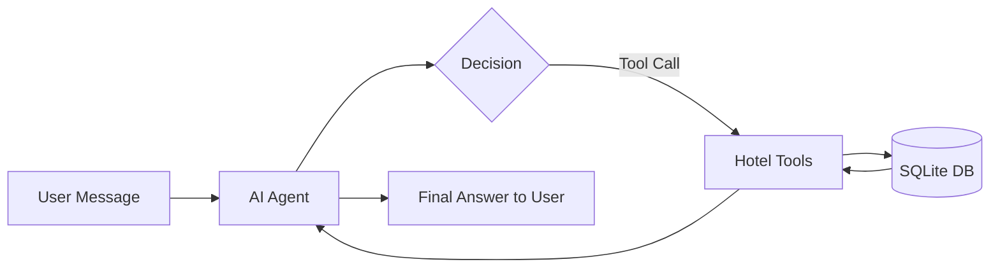

# Hotel Management Agent 🏨

A simple, clean, and practical AI agent for basic hotel management built with **FastAPI**, **SQLAlchemy**, **SQLite**, and an **OpenAI-compatible LLM** interface.

---

## 1. Project Title
**Hotel Management Agent** — Conversational AI for Hotel Front Desk & Operations.

---

## 2. Short Description
The **Hotel Management Agent** allows hotel staff or guests to interact with a hotel management database using natural language. Instead of navigating complicated management consoles, users can simply type queries like *"Show available rooms"*, *"Book room 101 for John"*, or *"Cancel booking 2"*. The agent intelligently selects and executes backend tools to query or update the SQLite database.

---

## 3. Features
- 💬 **Natural Language Interface**: Manage hotel reservations using plain English.
- 🧰 **Autonomous Tool Use**: The agent autonomously chooses between 6 dedicated tools.
- 🛏️ **Room Availability Check**: Filter available rooms by room type (Single, Double, Deluxe) and dates.
- 📝 **Reservation Creation**: Books rooms, creates guest records on-the-fly, and prevents double-booking.
- ❌ **Booking Cancellation**: Cancels existing bookings and releases rooms back into available inventory.
- 👥 **Guest Lookup**: Quickly query guest history and contact info.
- 📊 **Instant DB Seeding**: Starts with pre-seeded rooms and guests ready for immediate testing.
- ⚡ **Zero-Config Fallback Mode**: Works immediately out-of-the-box even before adding an OpenAI API key!

---

## 4. Tech Stack
- **Language**: Python 3.12+
- **Framework**: FastAPI (Asynchronous REST API)
- **Database**: SQLite with SQLAlchemy ORM
- **Validation**: Pydantic v2
- **AI / LLM**: OpenAI-compatible Function Calling API (OpenAI, Groq, Ollama, OpenRouter, etc.)
- **Frontend**: Clean Vanilla HTML5, CSS3, and JavaScript (no heavy build tools or frameworks)

---

## 5. Project Structure

```text
hotel-management/
├── app/
│   ├── __init__.py
│   ├── main.py              # FastAPI application entrypoint & static mounting
│   ├── database.py          # SQLAlchemy SQLite connection & auto-seeding
│   ├── models.py            # SQLAlchemy models (Guest, Room, Booking)
│   ├── schemas.py           # Pydantic schemas for API & Agent
│   ├── tools.py             # 6 Hotel Agent tools & OpenAI schema definitions
│   ├── agent.py             # LLM tool-calling loop & fallback interpreter
│   ├── routes/
│   │   ├── __init__.py
│   │   ├── rooms.py         # GET /rooms endpoint
│   │   ├── guests.py        # GET /guests endpoint
│   │   └── bookings.py      # GET, POST, DELETE /bookings endpoints
│   └── static/
│       ├── index.html       # Minimal clean chat UI
│       ├── style.css        # Responsive styling
│       └── app.js           # Frontend chat logic & API caller
├── docs/
│   ├── database-schema.md      # Database schema, table definitions & ER diagram
│   └── system-architecture.md  # Architectural overview & Mermaid diagram
├── .env.example             # Example environment variables
├── .gitignore
├── requirements.txt         # Project dependencies
└── README.md                # Project documentation
```

---

## 6. Database Description

Detailed schema and ER diagram are available in [docs/database-schema.md](docs/database-schema.md).

The system uses an embedded SQLite database (`hotel.db`) with three relational tables:

### `guests` Table
- `id` (INTEGER, Primary Key)
- `name` (VARCHAR, Indexed)
- `email` (VARCHAR, Optional)
- `phone` (VARCHAR, Optional)

### `rooms` Table
- `id` (INTEGER, Primary Key)
- `room_number` (VARCHAR, Unique, Indexed)
- `room_type` (VARCHAR: `Single`, `Double`, `Deluxe`)
- `price_per_night` (FLOAT)
- `status` (VARCHAR: `available`, `occupied`, `maintenance`)

### `bookings` Table
- `id` (INTEGER, Primary Key)
- `guest_id` (INTEGER, Foreign Key -> `guests.id`)
- `room_id` (INTEGER, Foreign Key -> `rooms.id`)
- `check_in` (VARCHAR, format `YYYY-MM-DD`)
- `check_out` (VARCHAR, format `YYYY-MM-DD`)
- `status` (VARCHAR: `confirmed`, `cancelled`)

**Default Seed Data:**
- Rooms:
  - `101` — Single ($50/night)
  - `102` — Single ($50/night)
  - `201` — Double ($80/night)
  - `202` — Double ($80/night)
  - `301` — Deluxe ($150/night)
  - `302` — Deluxe ($150/night)
- Guests: John Doe, Alice Smith, Robert Johnson.

---

## 7. How the AI Agent Works



1. **User input**: The user submits a natural-language prompt via the chat UI or `POST /agent/chat`.
2. **Context & Tool Definitions**: The agent formats the prompt with a system message containing the current date and sends it along with the 6 tool specifications (`check_room_availability`, `create_booking`, `get_bookings`, `cancel_booking`, `get_guests`, `get_rooms`).
3. **Tool Invocation**: The LLM analyzes the request and returns a structured tool call.
4. **Execution**: `execute_tool()` invokes the requested Python function against the SQLAlchemy database.
5. **Response Synthesis**: The tool's output is fed back to the LLM, which formats a clean, friendly response for the user.

*(Note: If `OPENAI_API_KEY` is not provided, the agent automatically falls back to an internal tool parser so you can test all queries immediately without needing an API key!)*

---

## 8. Setup Instructions

### 1. Clone or Open the Repository
```bash
cd "D:\projects\hotel management"
```

### 2. Create and Activate Virtual Environment
On Windows:
```bash
python -m venv venv
.\venv\Scripts\activate
```

On Linux/macOS:
```bash
python3 -m venv venv
source venv/bin/activate
```

### 3. Install Dependencies
```bash
pip install -r requirements.txt
```

---

## 9. Environment Variables

Copy `.env.example` to `.env`:
```bash
cp .env.example .env
```

Edit `.env` with your settings:
```env
# Optional: Set your OpenAI or OpenAI-compatible LLM Key
OPENAI_API_KEY=sk-your-openai-api-key
OPENAI_BASE_URL=https://api.openai.com/v1
OPENAI_MODEL=gpt-4o-mini
```

> **Note**: If you don't have an OpenAI key, leave it blank or don't create `.env`. The system will automatically use the built-in fallback engine.

---

## 10. How to Run the Backend

Start the server using `uvicorn`:
```bash
uvicorn app.main:app --reload --host 127.0.0.1 --port 8000
```

The database `hotel.db` will be initialized and seeded automatically on startup.

- **API Documentation (Swagger UI)**: [http://127.0.0.1:8000/docs](http://127.0.0.1:8000/docs)
- **Interactive ReDoc**: [http://127.0.0.1:8000/redoc](http://127.0.0.1:8000/redoc)

---

## 11. How to Run the Frontend

The frontend is served directly by FastAPI! Once the backend is running, open your browser and navigate to:

👉 **[http://127.0.0.1:8000](http://127.0.0.1:8000)**

You will see the clean Hotel Management Agent chat interface.

---

## 12. Example Agent Queries

Try typing any of the following queries into the chat interface:

| Intent | Example Query |
|---|---|
| **Check Available Rooms** | `"Show available rooms"` |
| **Filter by Room Type** | `"Are there any deluxe rooms available?"` |
| **Create a Booking** | `"Book room 101 for John"` |
| **List All Bookings** | `"Show all bookings"` |
| **Show Today's Bookings** | `"Show today's bookings"` |
| **Cancel a Booking** | `"Cancel booking 1"` |
| **Lookup Guest** | `"Show guest John"` |
| **List All Rooms** | `"Show all rooms"` |

---

## 13. REST Endpoints Overview

| Method | Endpoint | Description |
|---|---|---|
| `POST` | `/agent/chat` | Main conversational agent endpoint |
| `GET` | `/rooms` | List rooms (optional query params: `room_type`, `status`) |
| `GET` | `/guests` | List guests (optional query param: `name`) |
| `GET` | `/bookings` | List bookings (optional query param: `status`) |
| `POST` | `/bookings` | Create a new booking |
| `DELETE` | `/bookings/{id}` | Cancel/delete a booking |
