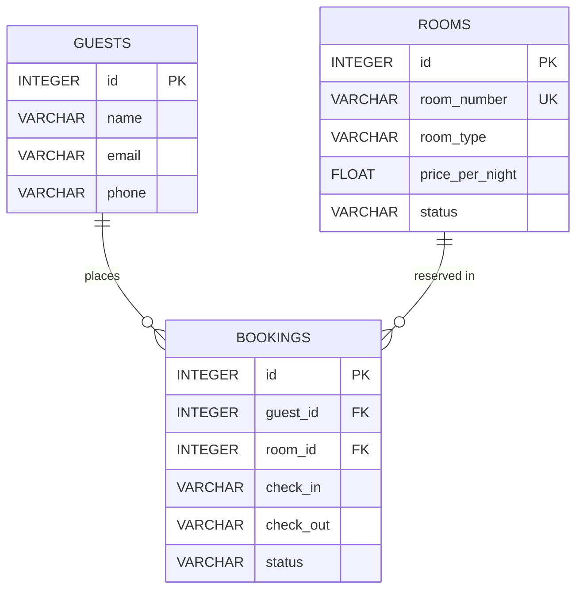

# Database Schema

This document details the database schema and entity relationships for the **Hotel Management Agent**, derived directly from the SQLite database (`hotel.db`) and SQLAlchemy models (`app/models.py`).

---

## Tables

### 1. Guest (`guests`)

Stores guest contact details and personal information.

| Column | Type | Constraints | Description |
| :--- | :--- | :--- | :--- |
| `id` | INTEGER | PRIMARY KEY, INDEX | Unique guest identifier |
| `name` | VARCHAR | NOT NULL, INDEX | Full name of the guest |
| `email` | VARCHAR | NULLABLE | Email address of the guest |
| `phone` | VARCHAR | NULLABLE | Phone contact number |

- **Primary Key**: `id`
- **Foreign Keys**: None

---

### 2. Room (`rooms`)

Represents hotel rooms, configurations, pricing, and availability states.

| Column | Type | Constraints | Description |
| :--- | :--- | :--- | :--- |
| `id` | INTEGER | PRIMARY KEY, INDEX | Unique room identifier |
| `room_number` | VARCHAR | NOT NULL, UNIQUE, INDEX | Room number (e.g., `"101"`, `"201"`) |
| `room_type` | VARCHAR | NOT NULL, INDEX | Room category (`"Single"`, `"Double"`, `"Deluxe"`) |
| `price_per_night` | FLOAT | NOT NULL | Nightly rate |
| `status` | VARCHAR | NOT NULL, DEFAULT `'available'` | Operational status (`"available"`, `"occupied"`, `"maintenance"`) |

- **Primary Key**: `id`
- **Unique Constraint**: `room_number`
- **Foreign Keys**: None

---

### 3. Booking (`bookings`)

Tracks room reservations made by guests, including reservation dates and status.

| Column | Type | Constraints | Description |
| :--- | :--- | :--- | :--- |
| `id` | INTEGER | PRIMARY KEY, INDEX | Unique booking identifier |
| `guest_id` | INTEGER | NOT NULL, FK (`guests.id`) | Reference to the booking guest |
| `room_id` | INTEGER | NOT NULL, FK (`rooms.id`) | Reference to the booked room |
| `check_in` | VARCHAR | NOT NULL | Check-in date (`YYYY-MM-DD`) |
| `check_out` | VARCHAR | NOT NULL | Check-out date (`YYYY-MM-DD`) |
| `status` | VARCHAR | NOT NULL, DEFAULT `'confirmed'` | Booking status (`"confirmed"`, `"cancelled"`) |

- **Primary Key**: `id`
- **Foreign Keys**:
  - `guest_id` → `guests(id)`
  - `room_id` → `rooms(id)`

---

## Relationships

- **Guest → Booking** (One-to-Many / `1:N`):
  - A guest can have zero, one, or multiple bookings.
  - Linked via `bookings.guest_id` referencing `guests.id`.
  - SQLAlchemy model defines cascade behavior: `all, delete-orphan`.

- **Room → Booking** (One-to-Many / `1:N`):
  - A room can have zero, one, or multiple bookings across different date ranges.
  - Linked via `bookings.room_id` referencing `rooms.id`.

- **Booking → Guest** (Many-to-One / `N:1`):
  - Each booking is associated with exactly one guest.

- **Booking → Room** (Many-to-One / `N:1`):
  - Each booking is associated with exactly one room.

---

## ER Diagram

