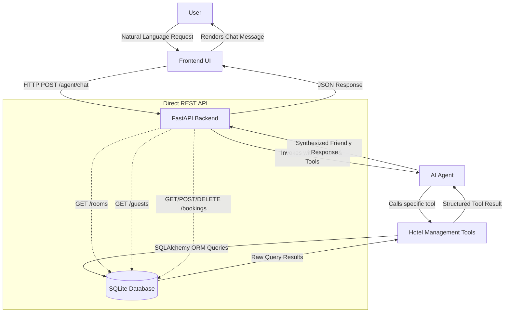
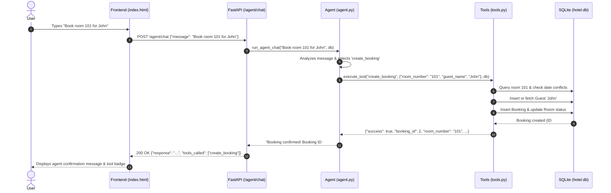

# System Architecture - Hotel Management Agent

This document details the system architecture, component interactions, and data flow for the **Hotel Management Agent**.

---

## 1. High-Level Architecture Overview

The system follows a lightweight, single-tier service architecture designed for simplicity, ease of deployment, and clear separation of concerns.

---

## 2. Component Breakdown

### 1. User
- Interacts with the system through natural language queries (e.g., *"Show available rooms"*, *"Book room 101 for John"*, *"Show today's bookings"*).

### 2. Simple Frontend (`app/static/`)
- **Technology**: Vanilla HTML5, CSS3, and modern JavaScript (zero build step or heavyweight framework required).
- **Functionality**:
  - Chat stream with message history and typing indicator.
  - Suggestion chips for quick, one-click prompts.
  - Displays tools invoked by the agent (`⚙️ check_room_availability`, etc.).
  - Communicates directly with the backend via `POST /agent/chat`.

### 3. FastAPI Backend (`app/main.py`, `app/routes/`)
- **Technology**: Python 3.12+, FastAPI, Uvicorn, Pydantic v2.
- **Responsibilities**:
  - Serves the static web frontend and API documentation (`/docs`).
  - Handles `/agent/chat` requests and feeds them to the AI agent.
  - Provides direct REST endpoints:
    - `GET /rooms` — List rooms and filter by type/status.
    - `GET /guests` — List and search guests.
    - `GET /bookings` — List bookings and filter by status/today.
    - `POST /bookings` — Create a booking programmatically.
    - `DELETE /bookings/{id}` — Cancel a booking.

### 4. AI Agent (`app/agent.py`)
- **Technology**: OpenAI-compatible function calling loop (works with OpenAI, Groq, Ollama, OpenRouter, etc.).
- **Mechanism**:
  - Injects system prompt with current date and domain context.
  - Supplies the LLM with the 6 hotel management tool schemas.
  - Evaluates tool calls returned by the model, executes them, and submits output back to the LLM to formulate a helpful conversational reply.
  - **Zero-Config Fallback Engine**: If no API key is supplied, a built-in rule/regex engine handles standard operations immediately so the application is instantly functional.

### 5. Agent Tools (`app/tools.py`)
Encapsulates all domain business logic in 6 clean functions:
1. `check_room_availability`: Inspects room availability and verifies overlapping date reservations.
2. `create_booking`: Creates a guest (if new) and books a room for specified dates.
3. `get_bookings`: Queries active, past, or today's bookings.
4. `cancel_booking`: Cancels an existing booking and marks room available.
5. `get_guests`: Searches or lists guest contact information.
6. `get_rooms`: Returns rooms with their type, price, and status.

### 6. SQLite Database (`app/database.py`, `app/models.py`)
- Embedded SQLite database (`hotel.db`) managed via **SQLAlchemy ORM**.
- Three core relational tables:
  - `guests` (id, name, email, phone)
  - `rooms` (id, room_number, room_type, price_per_night, status)
  - `bookings` (id, guest_id, room_id, check_in, check_out, status)
- Automatically seeded with 6 sample rooms and guests upon startup.
- Complete table definitions, constraints, and ER diagram are documented in [database-schema.md](database-schema.md).

---

## 3. Data Flow Example: Booking a Room

